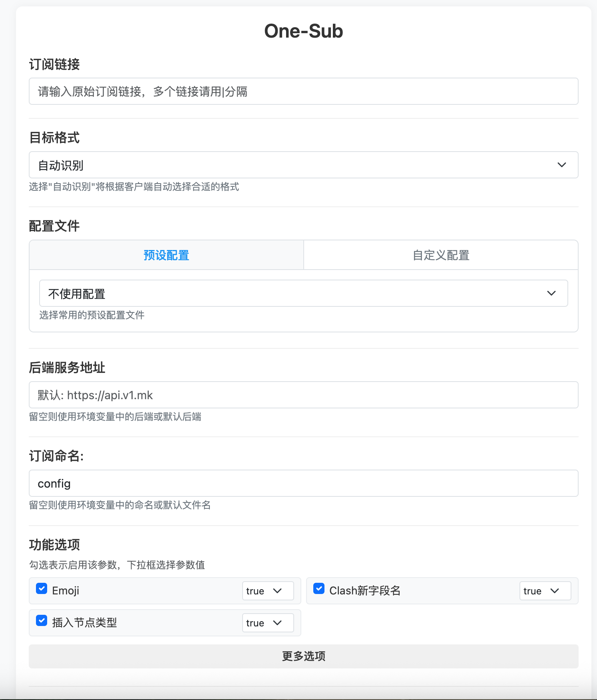
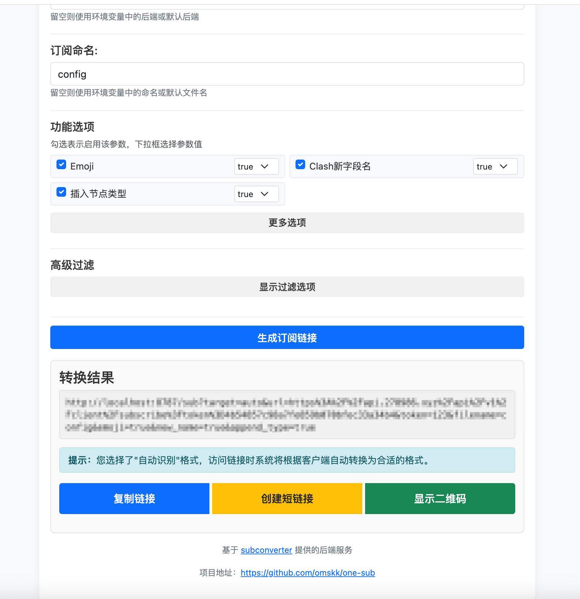
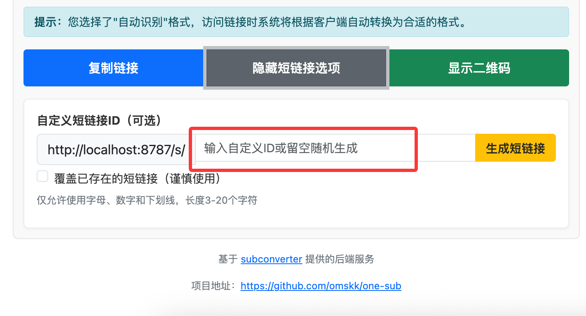
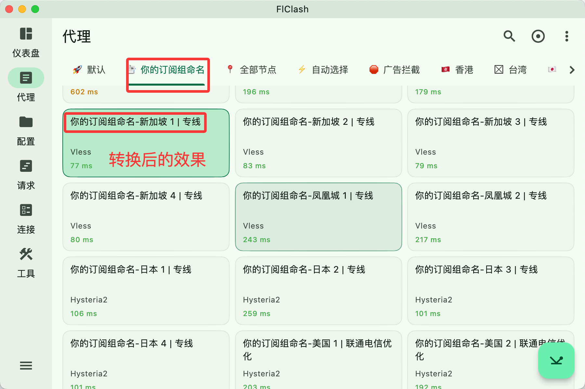

# One-Sub 订阅转换工具

<div align="center">

[](LICENSE)
[](https://github.com/omskk/one-sub/stargazers)
[](https://github.com/omskk/one-sub/issues)

</div>

## 📝 项目介绍

One-Sub 是一个强大的订阅转换工具，基于 Cloudflare Worker 构建。本工具可以实现多种代理订阅格式的互相转换，底层使用 [subconverter](https://github.com/tindy2013/subconverter) 作为转换引擎。


### ✨ 主要特性

- 🔄 支持多种主流订阅格式互转
- 🔍 支持自动识别客户端格式（auto）
- 🎨 现代化的 Web 界面设计，支持响应式布局
- ⚙️ 支持自定义后端地址
- 📄 支持自定义配置文件
- 🔐 支持访问令牌验证
- 🛠️ 丰富的转换参数配置
- 🔗 支持生成短链接和自定义短链接ID
- 📱 移动端友好的界面设计
- 🔎 高级过滤功能，支持关键词和正则表达式
- 🔀 支持多订阅合并功能，通过UUID访问


## 🖼️ 功能展示

<div align="center">
  
</div>
<details>
<summary>生成订阅链接</summary>
<div align="center">
  
</div>
</details>

<details>
<summary>创建短链接</summary>
<div align="center">
  
</div>
</details>

<details>
<summary>显示二维码</summary>
<div align="center">
  
</div>
</details>

<details>
<summary>合并订阅效果</summary>
<div align="center">
  
</div>
</details>

## 🔧 支持的订阅格式

| 客户端 | 支持状态 |
|-------|---------|
| Clash | ✅ |
| ClashR | ✅ |
| Quantumult | ✅ |
| Quantumult X | ✅ |
| Loon | ✅ |
| Mellow | ✅ |
| SS (SIP002) | ✅ |
| SS Android (SIP008) | ✅ |
| SSR | ✅ |
| SSD | ✅ |
| Surfboard | ✅ |
| Surge (2/3/4) | ✅ |
| Trojan | ✅ |
| V2Ray | ✅ |
| Mixed | ✅ |

## 🚀 快速开始
### Cloudflare Worker 部署方式
<details>
<summary><b>（点击展开）</b></summary>

### 方法一：通过 Web 界面部署（推荐）

1. 下载项目源码
   - 访问 [本项目仓库](https://github.com/omskk/one-sub) 
   - 点击 "Code" 按钮，然后选择 "Download ZIP"
   - 解压下载的 ZIP 文件

2. 登录 [Cloudflare Dashboard](https://dash.cloudflare.com/)

3. 进入 Workers & Pages 界面
   - 在左侧导航栏中点击 "Workers & Pages"

4. 创建新的 Worker
   - 点击 "创建应用程序" 按钮
   - 选择 "创建 Worker"

5. 上传代码
   - 在 Worker 编辑界面中，点击 "快速编辑"
   - 清空编辑器中的默认代码
   - 打开本地解压后的 `src/index.js` 文件，复制其中的所有代码
   - 将代码粘贴到 Cloudflare 编辑器中

6. 保存并部署
   - 点击 "保存并部署" 按钮

7. 配置环境变量（可选）
   - 部署完成后，点击 "设置" 选项卡
   - 选择 "变量" 菜单
   - 点击 "添加变量" 按钮添加所需的环境变量（见下文环境变量配置）

### 方法二：通过命令行部署

1. 克隆项目到本地
```bash
git clone https://github.com/omskk/one-sub.git
cd one-sub
```

2. 安装依赖
```bash
npm install
# 或
yarn install
```

3. 安装 Wrangler CLI
```bash
npm install -g wrangler
# 或
yarn global add wrangler
```

4. 登录到 Cloudflare
```bash
wrangler login
```

5. 修改 `wrangler.toml` 配置（可选）
```toml
name = "one-sub"  # 您的Worker名称
# 其他配置保持默认即可
```

6. 发布到 Cloudflare
```bash
npm run publish
# 或
yarn publish
```


### 环境变量配置

| 变量名 | 说明 | 是否必需 | 默认值 |
|-------|------|-----|--------|
| ACCESS_TOKEN | 访问令牌，用于验证访问权限 | 是   | - |
| DEFAULT_CONFIG | 默认配置文件链接 | 否   | - |
| CUSTOM_BACKEND | 自定义后端服务地址 | 否   | https://api.v1.mk |
| DEFAULT_FILENAME | 默认生成的配置文件名称 | 否   | config |
| UUID | 用于验证订阅合并功能的访问权限 | 否   | - |
| PROVIDER_1, PROVIDER_2, ... | 订阅提供者配置，格式为"名称,订阅链接" | 否   | - |

### KV 命名空间配置


<summary>短链接功能配置（点击展开）</summary>

短链接功能需要配置 Cloudflare Workers KV 命名空间：

1. 在 Cloudflare Dashboard 中创建 KV 命名空间
   - 进入 Workers & Pages
   - 点击 "KV" 选项卡
   - 点击 "创建命名空间"
   - 输入名称（如 `ONE_SUB_URLS`）并保存

2. 绑定 KV 命名空间到 Worker
   - 进入您的 Worker 设置页面
   - 点击 "变量" 选项卡，找到 "KV 命名空间绑定" 部分
   - 点击 "添加绑定"
   - 变量名称输入 `KV`
   - 选择刚才创建的 KV 命名空间
   - 点击 "保存并部署"


### 环境变量设置方法：

1. 在 Cloudflare Dashboard 中进入您的 Worker
2. 点击 "设置" > "变量"
3. 点击 "添加变量" 按钮
4. 输入变量名称和值
5. 点击 "保存并部署" 按钮

</details>

## 📖 使用指南

### 基础使用

1. 访问您部署的 Worker 域名（形如 `https://one-sub.xxx.workers.dev/ACCESS_TOKEN`）
2. 在订阅链接输入框中粘贴原始订阅地址
3. 选择目标转换格式（可选择"自动识别"让系统根据客户端自动选择最佳格式）
4. 选择配置文件（可选）
5. 配置其他参数（可选）
6. 点击 "生成订阅链接" 按钮
7. 复制生成的链接或短链接到对应的客户端使用

### 多订阅合并功能

One-Sub 提供了强大的订阅合并功能，可以将多个订阅合并为一个，便于管理：

1. 在 Worker 环境变量中配置 UUID（形如 `12345678-1234-1234-1234-123456789012`）
2. 添加订阅提供者配置，使用 `PROVIDER_1`, `PROVIDER_2` 等环境变量
   - 格式为："名称,订阅链接"，例如：`Sanfen,https://example.com/subscribe/1`
3. 通过访问 `https://your-worker.com/uuid/your-uuid` 获取合并后的订阅
4. 合并后的订阅会自动为每个来源的节点添加前缀，便于识别
5. 生成的配置为 Clash 格式，包含自动分组、地区分组等设置

配置示例：
```toml
# 在 wrangler.toml 中添加：
[vars]
UUID = "12345678-1234-1234-1234-123456789012"
PROVIDER_1 = "Sanfen,https://example.com/subscribe/1"
PROVIDER_2 = "Hneko,https://example.com/subscribe/2"
PROVIDER_3 = "BpYun,https://example.com/subscribe/3"
```

### 短链接使用

项目支持将长订阅链接转换为短链接，便于分享：

1. 生成订阅链接后，点击 "创建短链接" 按钮
2. 可以使用随机短链接ID或输入自定义ID（支持3-20个字母、数字或下划线）
3. 系统会生成一个短链接（形如 `https://your-worker.com/s/abc123`）
4. 短链接可以直接在客户端中使用，效果与原链接相同
5. 短链接永久有效（除非手动删除）

### 高级过滤功能

One-Sub 提供了强大的节点过滤功能：

1. 包含节点：只保留包含特定关键词的节点，多个关键词用|分隔
2. 排除节点：过滤掉包含特定关键词的节点，多个关键词用|分隔
3. 正则表达式：启用后可使用正则表达式进行更精确的过滤
4. 节点数量限制：限制返回的最大节点数量
5. 节点排序：支持按节点名称排序

### 进阶配置

<details>
<summary>预设配置文件和功能选项（点击展开）</summary>

#### 预设配置文件

我们提供以下几种预设配置文件供选择：

- ACL4SSR 精简版
- ACL4SSR 标准版
- ACL4SSR 多国家地区
- ACL4SSR 全分组
- ACL4SSR 全分组 多模式

您也可以输入自定义配置文件链接。


</details>

## 📚 常见问题
<details>
<summary>常见问题解答（点击展开）</summary>

### 1. 为什么生成的合并订阅链接中的节点timeout？
- 检查你的Clash软件是否安装了Tun（虚拟网卡模式）功能
- Tun模式是否是Mixed模式.
### 2. subconverter是什么？
- subconverter是一个开源的订阅转换工具，可以将各种订阅格式转换为Clash、Surge等客户端支持的格式。
- subconverter支持多种订阅格式，包括SS、SSR、V2Ray等，并且可以自定义转换规则。
- 如果想保证节点信息不泄露建议自建订阅转换服务。
### 3. 合并订阅是否需要后端服务？
- 不需要后端服务，合并订阅功能是直接生成文件。

### 4. 短连接无法生成？
- 确保您已正确配置 Cloudflare Workers KV 命名空间，并已绑定到您的 Worker。

### 5. 订阅转换功能无法使用？
- 有可能是默认后端的问题尽量使用自己的服务器搭建。
</details>

## 🛠️ 开发指南

<details>
<summary>本地开发和贡献指南（点击展开）</summary>

### 本地开发

1. 克隆项目并安装依赖
```bash
git clone https://github.com/omskk/one-sub.git
cd one-sub
npm install
```

2. 启动开发服务器
```bash
npx wrangler dev
```

3. 本地访问 Worker
   - 打开浏览器访问 `http://localhost:8787`

### 贡献指南

我们欢迎各种形式的贡献，包括但不限于：

- 🐛 报告Bug
- 💡 提出新功能或改进建议
- 📝 改进文档
- 🔍 代码审查和优化

贡献步骤：

1. Fork 本仓库
2. 创建您的特性分支 (`git checkout -b feature/amazing-feature`)
3. 提交您的更改 (`git commit -m 'Add some amazing feature'`)
4. 推送到分支 (`git push origin feature/amazing-feature`)
5. 打开一个 Pull Request
</details>

## 📜 许可证

本项目采用 MIT 许可证 - 查看 [LICENSE](LICENSE) 文件了解更多详情。

## 🙏 鸣谢

- [subconverter](https://github.com/tindy2013/subconverter) - 提供订阅转换的核心功能
- [Cloudflare Workers](https://workers.cloudflare.com/) - 提供可靠的无服务器执行环境
- 感谢 https://api.v1.mk 大佬提供的订阅转换服务（若有侵权请联系我删除）
- 感谢所有贡献者和用户的支持！

## 🤝 联系方式

如有问题或建议，请通过以下方式联系我们：

- [GitHub Issues](https://github.com/omskk/one-sub/issues) - 报告Bug或提出功能请求
- [GitHub Discussions](https://github.com/omskk/one-sub/discussions) - 讨论使用体验或提出问题

---

<div align="center">
  <p>如果您觉得这个项目有用，欢迎给它一个 ⭐️</p>
</div>
